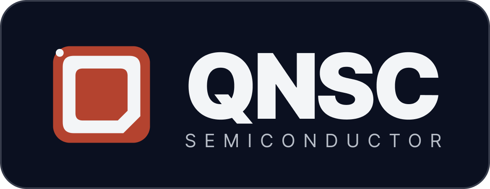

<!--
  BANNER: drop a 1280×360px PNG/SVG at  profile/assets/banner.png
  (suggested content: "QNSC — Quy Nhon Semiconductor" + tagline on a dark/branded background).
  Until the image exists, the alt text below shows as plain text — that's fine.
-->

# QNSC — Quy Nhon Semiconductor

**Design Service Today. Vietnamese Chips Tomorrow.**

A technology-driven **fabless semiconductor design center** with real in-house expertise
in front-end and back-end chip design, ASIC development, verification, and physical design.

---

## 🏢 About

**QNSC (Quy Nhon Semiconductor)** is a fabless IC design center based in Quy Nhon, Gia Lai
Province — Vietnam's rising semiconductor city. Backed by senior silicon architects with
25–40+ years across IBM, Meta, Intel, Samsung, TSMC, Arm, Synopsys, and Qualcomm, we deliver
end-to-end IC design and build a proprietary chip portfolio designed in Vietnam.

We operate in two streams:

| Stream | Focus |
| :----- | :---- |
| **A — Design Services** | End-to-end IC design outsourcing: Specs → Architecture → RTL → Verification → FPGA → GDSII → Bring-up → System |
| **B — Vietnamese Chips** | A proprietary chip portfolio: MCUs, IoT SoCs, and Secure Elements designed in-house |

> This GitHub organization hosts the **internal engineering platform** that runs QNSC —
> the software, infrastructure, and tooling our teams build to operate the company.

---

## 💻 What's in this organization

This org is where we build and run **QNSC's internal platform**. It is engineering tooling
for our own teams — not our silicon IP, which lives elsewhere.

| Project | What it is |
| :------ | :--------- |
| **Rally** | Internal work-management platform — an Agile project & portfolio tracker (modeled on Broadcom Rally) for planning chip-design and software delivery. `rally-web` · `rally-api` · `rally-infra` |
| **OpsHub** | Internal operations & DevOps tooling for the platform team. `opshub-web` · `opshub-api` · `opshub-infra` |
| **Infra / GitOps** | Shared infrastructure-as-code and GitOps delivery. `qnsc-infra` · `qnsc-ci` |

### On the roadmap
- 📚 **Knowledge Base** — an enterprise-grade knowledge platform for our teams and customers
- 🎓 **Learning System** — structured onboarding & on-the-job training for our engineer pipeline

---

## 🛠️ Tech Stack

-7B42BC?style=flat-square&logo=terraform&logoColor=white)

We build with **TypeScript** across web and API, **Terraform/HCL** for infrastructure, and a
**GitOps** workflow for delivery.

---

## 🤝 Contributing & Standards

These are **internal QNSC repositories**. Contributions come primarily from QNSC engineers
and approved partners.

- 📜 **How to contribute** — see [`CONTRIBUTING.md`](../CONTRIBUTING.md) for branching, commit, and PR conventions shared across all QNSC repos.
- 🤝 **Code of Conduct** — all contributors follow our [`CODE_OF_CONDUCT.md`](../CODE_OF_CONDUCT.md).
- 👥 **Ownership** — reviews are routed per [`CODEOWNERS`](../.github/CODEOWNERS); new repos should copy this file as their starting point.
- ✅ **Reviews** — every PR needs at least one approving review from a code owner and passing CI before merge.
- 🐛 **Issues & PRs** — use the issue and pull-request templates provided by this `.github` repo.
- 🔒 **Security** — never commit secrets or credentials. Report security concerns privately (see [`SECURITY.md`](../SECURITY.md)).

---

## 📬 Contact

**Quy Nhon Semiconductor Company (QNSC)**

- 🌐 Website — [qnsc.vn](https://qnsc.vn)
- 📍 Address — Floor 1, Pisico Building, 99 Tay Son Street, Quy Nhon Nam Ward, Gia Lai Province, Vietnam
- ✉️ Email — `info@qnsc.vn`
- ☎️ Phone — +84 779 446 268
- 💼 Careers — [qnsc.vn](https://qnsc.vn) — we're growing our engineering team in Quy Nhon

---

*© 2026 QNSC — Quy Nhon Semiconductor. Building Vietnam's chip-design capability through real execution.*

